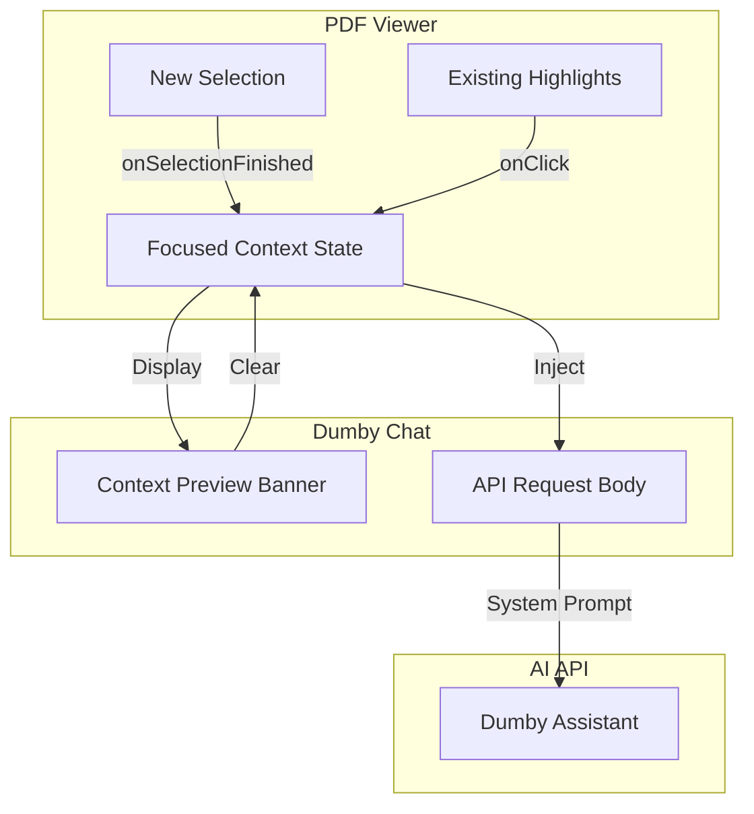

# Feature: PDF Context Synchronization

Sync document highlights with the Dumby chatbox to provide automatic context injection and visual feedback.

## Architecture Overview

The synchronization mechanism introduces a "Focused Snippet" state that acts as the single source of truth for the chat context.

## Technical Implementation

### 1. State Management
In `app/components/DumbyInterrogationReader.tsx`, we maintain:
- `focusedSnippet`: The string content of the currently active text.
- `focusedHighlightId`: The database ID of the active highlight (if any).

### 2. Synchronization Logic
- **New Selection**: When a user selects text, `onSelectionFinished` updates the `focusedSnippet`.
- **Existing Highlights**: Clicking an orange highlight sets it as the active context.
- **Visual Feedback**: The active highlight receives an orange glow to indicate it is being "discussed" with Dumby.

### 3. Chat Context Injection
When a message is sent via the chat input, the `focusedSnippet` is automatically included in the request body as the `context` parameter. The AI system prompt is configured to treat this snippet as the primary source of truth for its answers.

### 4. UI Components
- **Context Banner**: A small banner above the chat input shows a truncated preview of the active context.
- **Clear Button**: Allows the user to reset the context and engage in general chat.

### 5. Snipping Manager (Feature Extension)
- **Snippet Library**: A side-panel or tab within the sidebar that lists all saved highlights.
- **Referencing System**: Each snippet is assigned a sequential number (e.g., `[1]`, `[2]`).
- **Footnote Linkage**: The numbering appears both in the PDF overlay and the Snippet Library for easy cross-referencing.
- **Navigation**: Clicking a snippet in the library scrolls the PDF to that specific location and sets it as the active context.

